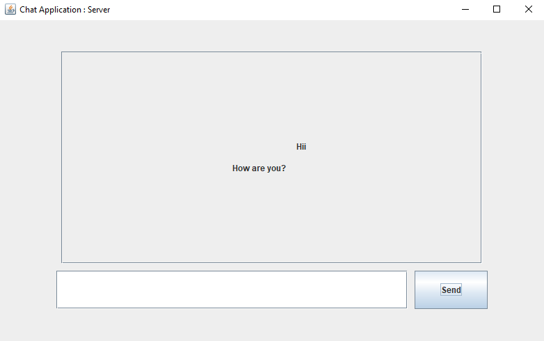
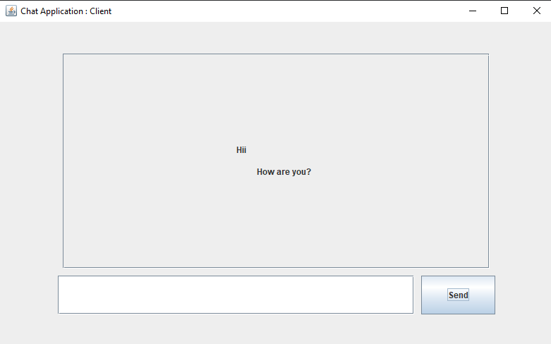

# Chat Application

---

### About
This is Simple Chat Application in Java. Gui was made using Java Swing. Sockets were used to send and receive messages. Threads were used to receive messages continuously.

### Images

